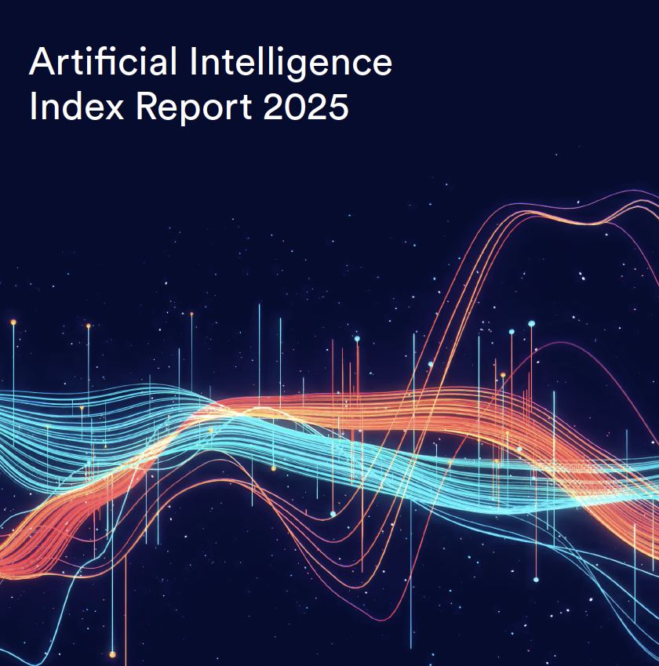

Welcome to the eighth edition of the AI Index report. The 2025 Index is our most comprehensive to date and arrives at an important moment, as AI’s influence across society, the economy, and global governance continues to intensify. New in this year’s report are in-depth analyses of the evolving landscape of AI hardware, novel estimates of inference costs, and new analyses of AI publication and patenting trends. We also introduce fresh data on corporate adoption of responsible AI practices, along with expanded coverage of AI’s growing role in science and medicine.

Since its founding in 2017 as an offshoot of the One Hundred Year Study of Artificial Intelligence, the AI Index has been committed to equipping policymakers, journalists, executives, researchers, and the public with accurate, rigorously validated, and globally sourced data. Our mission has always been to help these stakeholders make better-informed decisions about the development and deployment of AI. In a world where AI is discussed everywhere—from boardrooms to kitchen tables—this mission has never been more essential.

