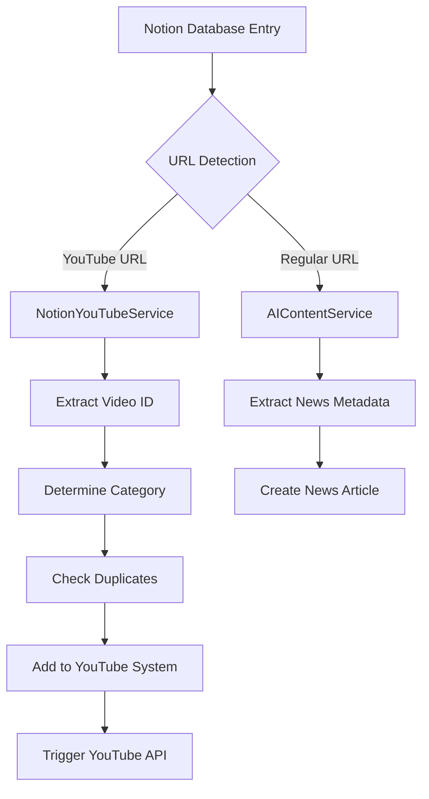

# Notion-YouTube Integration Enhancement

## 🚀 Overview

This enhancement extends the existing Notion content management system to automatically detect YouTube URLs and route them to the appropriate video management workflow instead of news processing. This creates a unified content management experience where Notion serves as the single source of truth for both news articles and video content.

## ✨ Key Features

### 🔍 Intelligent URL Detection
- Automatically scans Notion database entries for YouTube URLs
- Supports multiple YouTube URL formats (youtube.com, youtu.be, embed URLs)
- Filters YouTube content out of news processing pipeline

### 🤖 Smart Categorization
- AI-powered category determination based on title and source content
- Maps Notion data to appropriate video categories:
  - AI & Future of Work
  - Web3 & Blockchain
  - Robotics & Manufacturing
  - Tech Innovation
  - Future of Work
  - VR & Metaverse
  - Interview (default)

### 🔄 Seamless Integration
- Adds YouTube videos to the existing video management system
- Preserves existing admin interface workflows
- Maintains duplicate detection and error handling
- Triggers YouTube API for metadata fetching

## 🏗️ Architecture

### Enhanced Components

1. **NotionClient** (`lib/notion-client.ts`)
   - Added `isYouTubeUrl()` method for URL pattern detection
   - Added `getYouTubeRecords()` to fetch YouTube entries
   - Modified `getIncompleteRecords()` to exclude YouTube URLs

2. **NotionYouTubeService** (`lib/notion-youtube-service.ts`)
   - New service class handling YouTube-specific processing
   - Video metadata extraction and categorization
   - Integration with existing YouTube management system
   - Duplicate detection and error handling

3. **API Endpoints**
   - `/api/notion-youtube` - YouTube-specific processing endpoint
   - Enhanced `/api/ai-content-extraction` with combined processing

4. **Test Interface** (`/notion-youtube-test`)
   - Interactive testing and monitoring dashboard
   - Real-time statistics and processing results
   - Detailed error reporting

## 🚦 How It Works

### Data Flow



### Processing Steps

1. **URL Analysis**: System scans Notion entries for Source URLs
2. **Content Routing**: 
   - YouTube URLs → YouTube processing pipeline
   - Regular URLs → News processing pipeline
3. **YouTube Processing**:
   - Extract video ID from URL
   - Analyze title/source for categorization
   - Check for existing videos to prevent duplicates
   - Create video entry in management system
   - Trigger YouTube API for metadata
4. **News Processing**: 
   - Extract webpage content using AI
   - Generate news articles with metadata
   - Exclude YouTube URLs from this pipeline

## 📋 Setup Requirements

### Environment Variables
```bash
# Existing requirements
NOTION_TOKEN=your_notion_integration_token
NOTION_DATABASE_ID=your_notion_database_id
OPENAI_API_KEY=your_openai_api_key
YOUTUBE_API_KEY=your_youtube_api_key

# Optional: Admin credentials for authentication
ADMIN_USERNAME=your_admin_username
ADMIN_PASSWORD=your_admin_password
```

### Notion Database Schema
Your Notion database should have these properties:
- **Title** (Title field)
- **Source** (Rich Text)
- **Publication Date** (Date)
- **Source URL** (URL) - This is where YouTube URLs are detected
- **Status** (Select with "Published" option)

## 🎯 Usage

### Automatic Processing

The system can automatically process content in several ways:

#### 1. Process YouTube Content Only
```bash
POST /api/notion-youtube
{
  "action": "process-all"
}
```

#### 2. Process All Content (News + YouTube)
```bash
POST /api/ai-content-extraction
{
  "action": "process-all-content"
}
```

#### 3. Get Processing Statistics
```bash
GET /api/notion-youtube
```

### Manual Testing

Visit `/notion-youtube-test` to:
- View current YouTube detection statistics
- Test YouTube processing with real data
- Monitor processing results and errors
- Test combined content processing

### Workflow Example

1. **Add content to Notion**:
   - News article: `https://techcrunch.com/ai-breakthrough`
   - YouTube video: `https://youtube.com/watch?v=abc123`

2. **Run processing**:
   ```bash
   # Process all content
   curl -X POST /api/ai-content-extraction \
     -H "Content-Type: application/json" \
     -d '{"action": "process-all-content"}'
   ```

3. **Results**:
   - News article → `content/news/` directory
   - YouTube video → `content/youtube/videos/` directory
   - Both appear in respective admin interfaces

## 🔧 Configuration

### Category Mapping

The system maps Notion content to video categories using keyword detection:

```typescript
// Source-based categorization
if (source.includes('ai')) return 'AI & Future of Work';
if (source.includes('web3')) return 'Web3 & Blockchain';
if (source.includes('robot')) return 'Robotics & Manufacturing';

// Title-based categorization  
if (title.includes('artificial intelligence')) return 'AI & Future of Work';
if (title.includes('blockchain')) return 'Web3 & Blockchain';
if (title.includes('metaverse')) return 'VR & Metaverse';
```

### Custom Categories

To add new categories, update:
1. `NotionYouTubeService.determineCategory()`
2. Admin interface category options
3. Video management system schemas

## 📊 Monitoring

### Available Statistics

- **YouTube Record Count**: Number of YouTube URLs in Notion
- **Total Notion Records**: All records in database
- **Processing Success Rate**: Successful vs failed processing
- **Duplicate Detection**: Videos already in system

### Error Handling

The system provides detailed error reporting:
- Invalid YouTube URLs
- Duplicate video detection
- API failures (Notion, YouTube, OpenAI)
- File system errors
- Authentication issues

## 🚨 Troubleshooting

### Common Issues

#### "No YouTube records found"
- Check Notion database has YouTube URLs in Source URL field
- Verify Status is set to "Published"
- Ensure URL format is valid YouTube format

#### "Video already exists"
- System prevents duplicates automatically
- Check existing videos in admin interface
- Use video management system to update existing entries

#### "Invalid YouTube URL"
- Verify URL is properly formatted
- Supported formats:
  - `https://youtube.com/watch?v=VIDEO_ID`
  - `https://youtu.be/VIDEO_ID`
  - `https://youtube.com/embed/VIDEO_ID`

#### Processing fails silently
- Check server logs for detailed error messages
- Verify all environment variables are set
- Test API endpoints individually
- Use test interface for debugging

### Debug Mode

Enable detailed logging by setting:
```bash
NODE_ENV=development
```

Then check console output during processing for detailed step-by-step information.

## 🔮 Future Enhancements

### Potential Improvements

1. **Bi-directional Sync**: Update Notion when videos are modified in admin
2. **Batch Operations**: Process multiple videos simultaneously
3. **Advanced Categorization**: Machine learning-based category detection
4. **Content Scheduling**: Publish videos at specific times
5. **Analytics Integration**: Track video performance metrics
6. **Webhook Integration**: Real-time processing via Notion webhooks

### Extensibility

The system is designed to be easily extended:
- Add new URL pattern detection for other platforms
- Integrate additional metadata sources
- Extend categorization logic
- Add custom processing workflows

## 📚 API Reference

### NotionYouTubeService Methods

```typescript
// Process all YouTube records from Notion
processAllYouTubeRecords(): Promise<YouTubeProcessingStats>

// Process a single YouTube record
processYouTubeRecord(record: NotionNewsItem): Promise<YouTubeProcessingResult>

// Get current statistics
getProcessingStats(): Promise<{ youtubeRecordCount: number; totalNotionRecords: number }>
```

### Enhanced AIContentService Methods

```typescript
// Process all content (news + YouTube)
processAllContent(): Promise<{
  newsStats: ProcessingStats;
  youtubeStats: YouTubeProcessingStats;
  summary: string;
}>

// Get comprehensive statistics
getProcessingStats(): Promise<{
  incompleteCount: number;
  totalCount: number;
  youtubeCount: number;
  totalNotionRecords: number;
}>
```

## 🎉 Benefits

### For Content Managers
- **Unified Workflow**: Single Notion database for all content
- **Automatic Routing**: No manual categorization needed
- **Error Prevention**: Duplicate detection and validation
- **Time Savings**: Reduced manual data entry

### For Developers
- **Clean Architecture**: Separation of concerns between content types
- **Extensible Design**: Easy to add new content types
- **Comprehensive Logging**: Detailed error reporting and debugging
- **API-First**: All functionality exposed via REST APIs

### For Users
- **Consistent Experience**: Videos and news articles properly categorized
- **Better Discovery**: Content appears in appropriate sections
- **Rich Metadata**: Automatic title, description, and thumbnail fetching
- **Up-to-date Content**: Real-time synchronization with content sources

This enhancement transforms the Notion integration from a simple news management tool into a comprehensive content management system that intelligently handles different types of content while maintaining the existing user experience and admin workflows. 